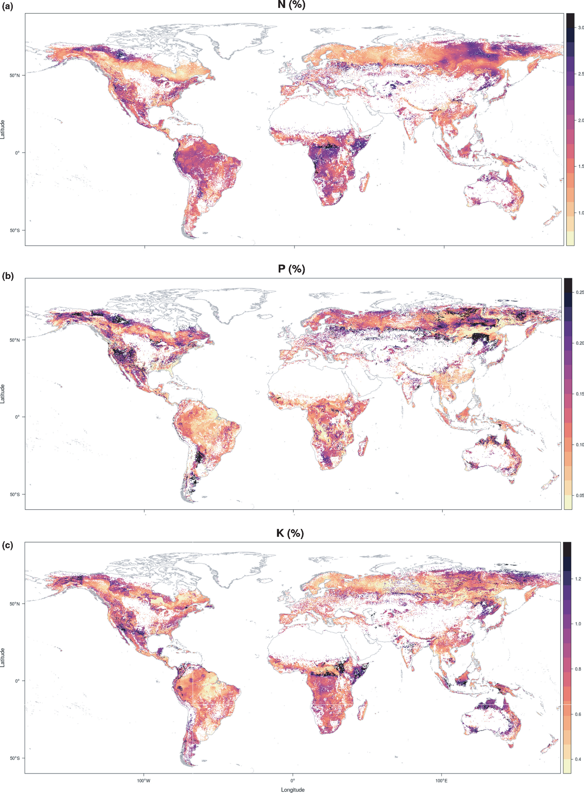

Portfolio of curated databases, maps and usables, ready to download.

---

## Maps

#### Foliar N, P and K global upscaled maps in woody plants
It contains global maps of foliar N, foliar P and foliar K in woody vegetation with its corresponding standard error map. 1 km resolution and .grd format. Originally published on Vallicrosa et al., 2021, New Phy (see Publications).

Download from [Zenodo](https://zenodo.org/records/7825970)

---

## Databases

#### Foliar stoichiometry of woody plants worldwide
This data includes foliar N, P, K % in DW of mature leaves in woody plants worldwide, georeferenced information and plant specie. It gathers data from 230 published articles, TRY database (http://www.try-db.org/TryWeb/dp.php), ICP forest database (http://icp-forests.net/page/data-requests), the Tundra Trait Team and the Catalan Forest Inventory (Gracia et al., 2004). Compiled until 2020, ~24000 data points.

---

## Code 
